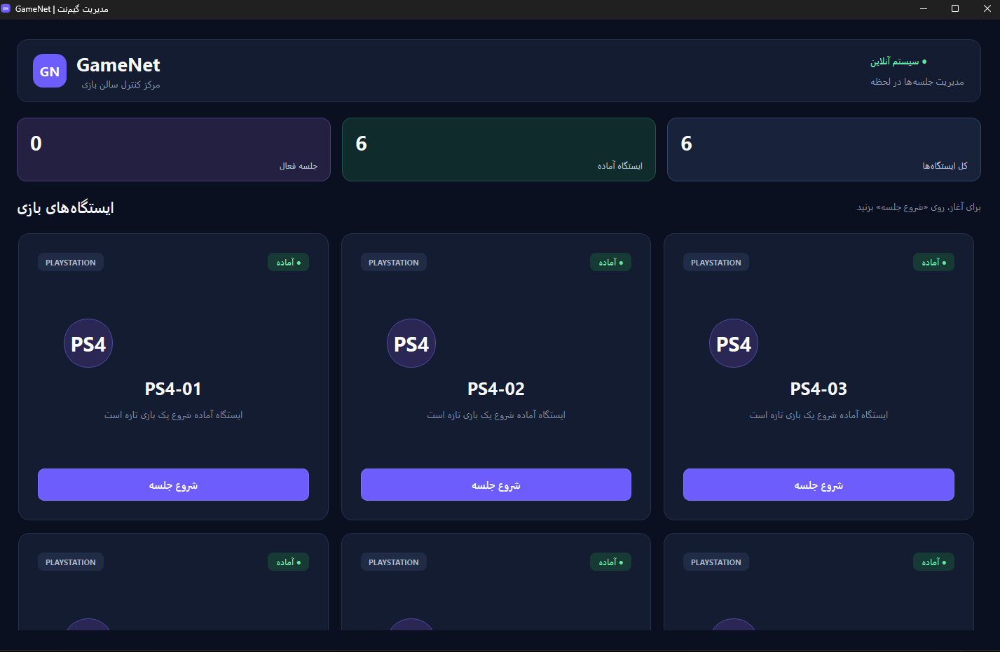
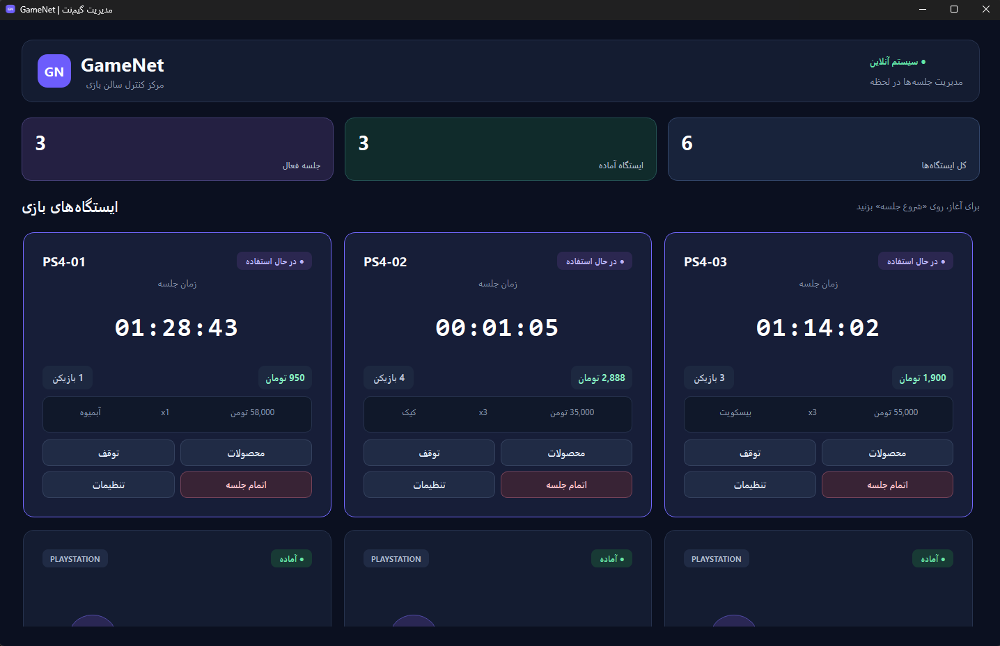
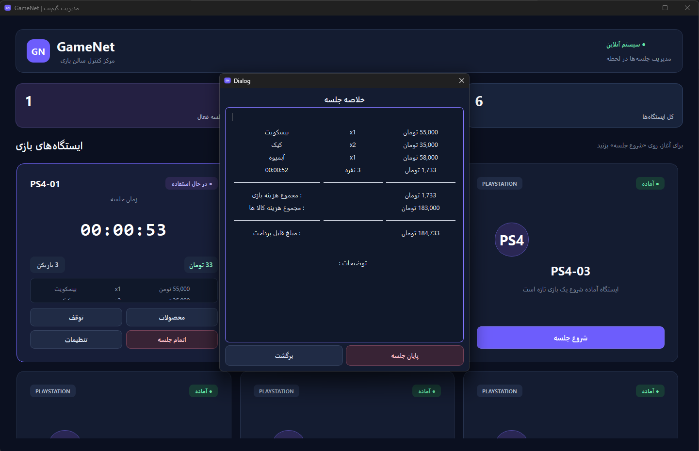
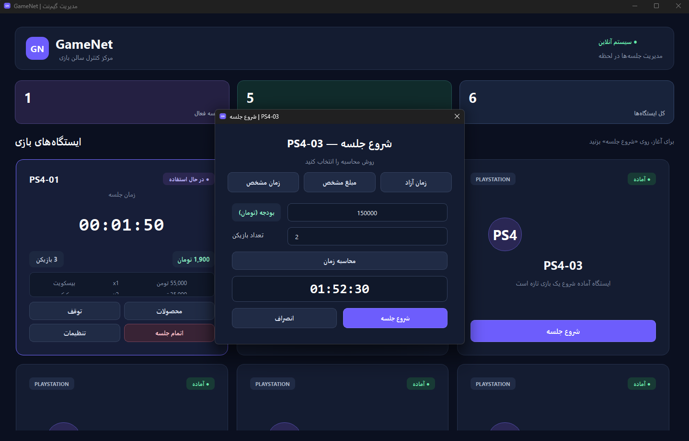

# GameNet Manager

A desktop application for managing gaming center sessions, pricing, products, and customer usage.

`GameNet Manager` is designed to simplify the daily management of gaming systems such as `PC`, `PS4`, `PS5`, `VR`, and `Steering Wheel`.

## Screenshots

### Main Dashboard

<!-- Add screenshot here -->



### Active Session

<!-- Add screenshot here -->



### Session Summary

<!-- Add screenshot here -->



### Start Session

<!-- Add screenshot here -->



> Replace the image paths above with your actual screenshots.

---

## Features

* Manage different gaming platforms
* Start and end gaming sessions
* Pause and resume sessions
* Extend session time
* Track elapsed time
* Calculate session costs based on platform and player count
* Change player count during a session
* Add products and quantities to a session
* Add notes to sessions
* View a detailed session summary
* Support for multiple gaming platforms

### Supported Platforms

* `PC`
* `PS4`
* `PS5`
* `VR`
* `Steering Wheel`

---

## Tech Stack

* `C++`
* `Qt 6`
* `CMake`
* `MinGW`
* `Qt Widgets`

---

## Installation

Download the latest installer from the `Releases` section.

Run the installer and follow the setup instructions.

No additional database setup is required.

---

## Building from Source

### Requirements

* `Qt 6`
* `CMake`
* `MinGW` or another supported `C++` compiler

### Clone the Repository

```bash
git clone https://github.com/Mohsenhatami000/GameNet-Manager.git
cd GameNet-Manager
```

### Build

```bash
cmake -S . -B build
cmake --build build --config Release
```

The generated executable can then be found in the corresponding build directory.

---

## Project Structure

The project is organized into separate components for the user interface and application logic.

```text
GameNet-Manager/
├── app/
├── Logic/
├── UI/
├── resources/
├── CMakeLists.txt
└── README.md
```

---

## Roadmap

Possible improvements for future versions include:

* More flexible application settings
* Improved customization
* Additional reporting features
* Improved UI and user experience
* Persistent data storage
* Additional management features

---

## Version

Current version: `v1.0.0`

This release represents the first `MVP` version of `GameNet Manager`.

---

## License

This project is currently released for demonstration and portfolio purposes.
